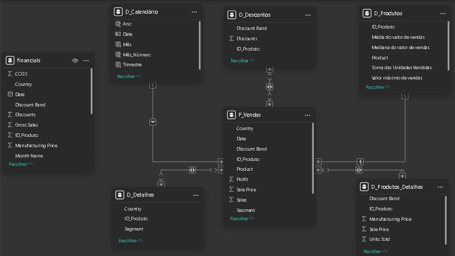

# Desafio de Projeto: Modelagem e Transformação de Dados no Power BI

Este repositório contém a solução para o desafio de projeto focado na transformação de uma base de dados única (flat table) em um modelo dimensional **Star Schema** (Esquema em Estrela). O objetivo principal é otimizar a performance e a organização dos dados para facilitar a análise e a criação de relatórios.

## 📊 Modelo de Dados (Star Schema)

Abaixo está a representação visual do modelo dimensional construído ao final do processo de transformação e conexões:



---

## 📈 Processo de Construção do Modelo

O processo foi dividido nas etapas de Extração/Transformação, Criação de Inteligência de Tempo e Modelagem de Relacionamentos.

### 1. Preparação e Backup
* **financials_origem**: Realizei a carga da base de dados original e criei uma cópia de segurança. Esta tabela foi definida como "oculta" no modelo e a sua carga foi desabilitada para o relatório, servindo estritamente como referência de backup e integridade.

### 2. Criação das Tabelas Dimensão (D_)
As tabelas dimensão foram criadas a partir da tabela original, selecionando as colunas pertinentes para reduzir a redundância e atribuindo identificadores (`ID_Produto`) baseados em lógicas condicionais:

* **D_Produtos**: Criada através da funcionalidade de agrupamento. A granularidade foi definida pelo nome do Produto, consolidando as seguintes agregações:
    * Soma das Unidades Vendidas
    * Média do valor de vendas
    * Mediana do valor de vendas
    * Valor máximo de Venda
    * Valor mínimo de Venda
* **D_Produtos_Detalhes**: Contém informações específicas de custos de fabricação e preços unitários (`ID_Produto`, `Discount Band`, `Sale Price`, `Units Sold`, `Manufacturing Price`).
* **D_Descontos**: Focada na relação entre produtos e suas respectivas métricas e faixas de desconto (`ID_Produto`, `Discount`, `Discount Band`).
* **D_Detalhes**: Tabela complementar com informações contextuais de vendas, isolando a localização e o público-alvo (`Segment`, `Country`).
* **D_Calendário**: Tabela gerada dinamicamente, fundamental para garantir a integridade das análises temporais (Time Intelligence) ao longo do dashboard.

### 3. Criação da Tabela Fato (F_)
* **F_Vendas**: É a tabela central do modelo, contendo as métricas quantitativas e as chaves de relacionamento com as dimensões.
    * Foi criada uma coluna de índice **SK_ID** (Surrogate Key) para identificação primária e única de cada transação registrada.
    * Colunas mantidas: `SK_ID`, `ID_Produto`, `Produto`, `Units Sold`, `Sales Price`, `Discount Band`, `Segment`, `Country`, `Sales`, `Profit` e as datas de venda.

---

## ⚠️ Nota Técnica sobre a Modelagem e Regras de Negócio

Durante o estabelecimento dos relacionamentos do Star Schema, as tabelas `D_Descontos`, `D_Detalhes` e `D_Produtos_Detalhes` assumiram uma cardinalidade **N:N (Muitos para Muitos)** com a tabela Fato. 

Isso ocorre como reflexo direto das diretrizes e da granularidade da base *Financial Sample*. Como a chave de ligação estrutural determinada para as dimensões foi exclusivamente o `ID_Produto`, e um mesmo produto apresenta variações naturais de faixas de desconto e locais de venda (ex: um mesmo produto vendido em múltiplos países), a repetição do ID nestas dimensões gerou essa cardinalidade adaptada para satisfazer a visão do projeto.

---

## 🔢 Funções Aplicadas

Para a construção da inteligência de tempo (tabela de calendário), utilizei a seguinte lógica para varrer e abranger de forma responsiva todo o período de vendas presente na tabela fato:

```dax
D_Calendário = CALENDAR(
    MIN(F_Vendas[Date]), 
    MAX(F_Vendas[Date])
)
